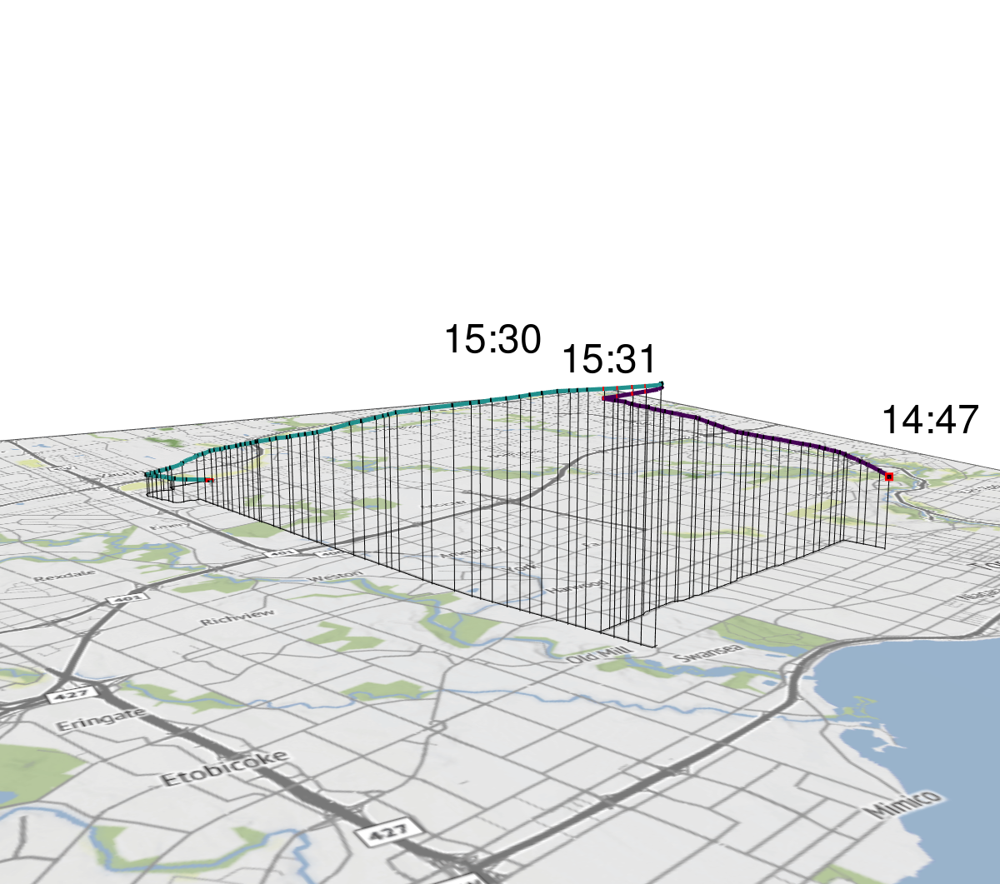
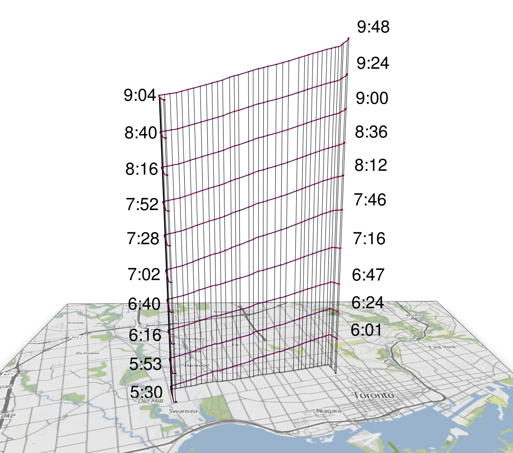
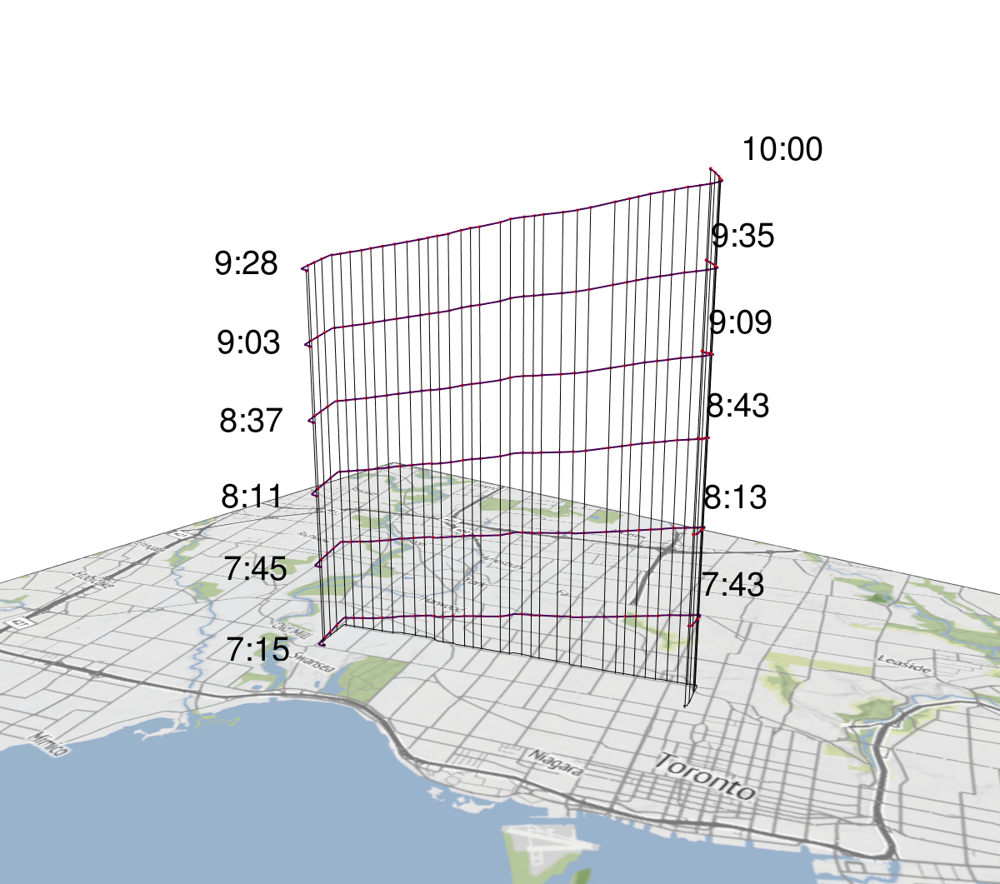
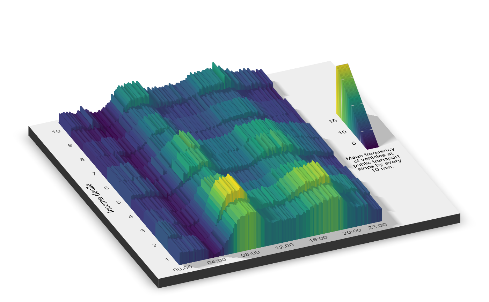

```{r setup, include=FALSE}
knitr::opts_chunk$set(echo = TRUE)
```

# Introduction

This project is based on Rafael Periera's 2022 paper titled *Exploring the Time Geography of Public Transit Networks*. I have replicated his methods and analysis with data from Toronto and the Toronto Transit Commission (TTC) by adapting Rafael's scripts found at https://github.com/ipeaGIT/gtfs2gps-time_geography. My adapted scripts can be found at https://github.com/jujujames/4MS3_JV

Original Paper:

R.H.M.Pereira et al. (2022). Exploring the Time Geography of Public Transit Networks. Journal of Geographical Systems (2023) 25:453–466 https://doi.org/10.1007/s10109-022-00400-x

# 0.0 Setup and Data Preparation

This section covers the initial setup, including loading libraries and preparing the geographic boundary and GTFS data specific to Toronto.

## Load required packages
```{r}
library(gtfs2gps)
library(gtfstools)
library(data.table)
library(sf)
library(dplyr)
library(magrittr)
library(ggplot2)
library(ggmap)
library(rayshader)
library(rayrender)
library(rayimage)
library(cancensus)
library(viridis) 
library(sfheaders)
library(progressr)
library(pbapply)
library(patchwork)
library(stringr)
library(raster)
library(terra)
library(mapview)
library(tinytex)
```

## Retrieve Toronto's Census Subdivision boundary

```{r}
# Visit [https://censusmapper.ca/api](https://censusmapper.ca/api) to obtain an API key for the cancensus package
# options(cancensus.api_key = "api key")

toronto_bound <- cancensus::get_census(
  dataset = "CA21",            # Use the 2021 Canadian Census
  regions = list(CSD = "3520005"), # CSD code for Toronto
  level = "CSD",               # Specify the census subdivision level
  geo_format = "sf",           # Request output in sf format
  use_cache = TRUE             # Use cached data if available
)

# Transform to WGS84 coordinate system
toronto_bound <- sf::st_transform(toronto_bound, 4326)  

# Save the boundary data
readr::write_rds(toronto_bound, "data/toronto_bound_CSD.rds")
```

## Prepare TTC GTFS data

```{r}
# ttc_gtfs_url <- "https://ckan0.cf.opendata.inter.prod-toronto.ca/dataset/7795b45e-e65a-4465-81fc-c36b9dfff169/resource/cfb6b2b8-6191-41e3-bda1-b175c51148cb/download/TTC%20Routes%20and%20Schedules%20Data.zip"
# download.file(url = ttc_gtfs_url, destfile = "data-raw/ttc_gtfs.zip")
ttc_gtfs_raw <- gtfstools::read_gtfs("data-raw/ttc_gtfs.zip")
```

## Process TTC GTFS data

Add shape_id to stop_times
```{r}
ttc_gtfs_raw$stop_times[ttc_gtfs_raw$trips,on = "trip_id",shape_id := i.shape_id]
```

Filter GTFS for sections 1.1, 1.2.1, & 1.2.2
```{r}
# Filter by a specific shape_id (a single bus route variation) for use in scripts 1.2.1 & 1.2.2
ttc_gtfs <- gtfstools::filter_by_shape_id(ttc_gtfs_raw, "1048831")

# Save this filtered GTFS data
gtfs2gps::write_gtfs(ttc_gtfs,"data/gtfs_ttc_1048831.zip")

# Filter specific intersecting trips for section 1.1 ... I did this by manually sifting through the GTFS .txt files
ttc_gtfs_tmp <- gtfstools::filter_by_shape_id(ttc_gtfs_raw, c("1048833", "1049212"))
ttc_gtfs_tmp <- gtfstools::filter_by_trip_id(ttc_gtfs_tmp, c("48337409", "48334845"))

# Convert these specific trips to GPS-like points
gps_tmp <- gtfs2gps::gtfs2gps(ttc_gtfs_tmp)

# Adjust speed estimates between points
gps_tmp <- gtfs2gps::adjust_speed(gps_tmp)

# Save the processed GPS data for section 1.1
readr::write_rds(x = gps_tmp, "data/ttc_intersection_gps.rds")
```

# 1.1: Visualizing Trip Intersections

This section loads the pre-processed TTC intersection data created in the previous step and uses `rayshader` to create a 3D visualization. Time is represented on the vertical axis to illustrate the timing of the two selected intersecting trips.

```{r}
rm(list=ls())
gc(reset = TRUE)

# Load the RDS file saved at the end of script 0.0
gps_dt <- readr::read_rds("data/ttc_intersection_gps.rds")
```

## Adjust data for visualization & deal with midnight trips
```{r}
# Prepare tmp_gps: calculate time differences, add segment end coordinates
tmp_gps <- data.table::copy(gps_dt) %>%
  .[!is.na(timestamp),] %>%
  .[,.SD[1],by = .(shape_pt_lon,shape_pt_lat)] %>% # Keep unique points
  .[,time := as.numeric(timestamp)] %>% 
  .[,time1 := data.table::shift(time,1,NA,"lead"),by = trip_number] %>%
  .[,diff := time1 - time] 

tmp_gps <- data.table::copy(tmp_gps) %>%
  .[!is.na(timestamp),] %>%
  .[,.SD[1],by = .(shape_pt_lon,shape_pt_lat)] %>% 
  .[,time := as.numeric(timestamp)] %>%
  .[,shape_pt_lon_end := data.table::shift(shape_pt_lon,-1,NA), by = shape_id] %>%
  .[,shape_pt_lat_end := data.table::shift(shape_pt_lat,-1,NA), by = shape_id]

# Prepare tmp_stops: filter for valid stop records, create altitude based on time, rename coordinates
tmp_stops <- data.table::copy(tmp_gps) %>%
  .[,.SD[1],by = .(shape_pt_lon,shape_pt_lat)] %>% 
  .[!is.na(cumtime) & !is.na(stop_id) & !is.na(timestamp),] %>%  
  .[,time := as.numeric(timestamp)] %>% 
  .[,altitude := 100 * time/max(time)] %>% # Simple scaling of time to altitude
  data.table::setnames(.,old = c("shape_pt_lon","shape_pt_lat")
                       , new = c("X","Y"))
```

## Create Spatial Objects & Bounding Box
```{r}
# Create sf object for stops
# Transforming to UTM Zone 17N (EPSG:32617) for Toronto area
view_tmp_stops <- data.table::copy(tmp_stops) %>% 
  sfheaders::sf_multipoint(.,x = "X"
                          ,  y = "Y"
                          , multipoint_id = "shape_id") %>%
  sf::st_set_crs(4326) %>% # WGS 1984
  sf::st_transform(32617) # UTM zone 17N for Toronto

# Convert stop points to sf LINESTRING object
tmp_line <- data.table::copy(tmp_gps) %>%
  .[,.SD[1],by = .(shape_pt_lon,shape_pt_lat)] %>% 
  .[!is.na(cumtime) & !is.na(stop_id) & !is.na(timestamp),] %>%
  sfheaders::sf_linestring(obj = .
                          , x = "shape_pt_lon"
                          , y = "shape_pt_lat"
                          , linestring_id = "shape_id"
                          , keep = TRUE) %>%
  sf::st_set_crs(4326)

# Create a bounding box polygon around the lines
# Buffer is applied in UTM coordinates (meters) then transformed back to WGS84
tmp_gps_bbox <- tmp_line %>%
  sf::st_transform(4326) %>%
  sf::st_transform(32617) %>% # Use Toronto's UTM Zone 17N
  sf::st_buffer(x = .,dist = 8000) %>% # 8km buffer
  sf::st_transform(4326) %>%
  sf::st_bbox() %>%
  as.numeric() %>%
  data.frame("X" = c(.[1],.[1],.[3],.[3])
             ,"Y" = c(.[2],.[4],.[4],.[2])) %>%
  sfheaders::sf_polygon(.,x = "X",y = "Y") %>%
  sf::st_set_crs(4326)
```

## Download base map tile
```{r}
# Extract bounding box coordinates for ggmap/get_stadiamap
osm_bbox = tmp_gps_bbox %>% 
  raster::extent() %>%
  as.vector() %>% 
  .[c(1,3,2,4)]


# Stamen map tiles previously used are now hosted by Stadia Maps.
# An API key is required.
# Visit [https://client.stadiamaps.com/signup/](https://client.stadiamaps.com/signup/) to obtain an API key.
# Register api key
# ggmap::register_stadiamaps(key = "api key", write = TRUE) 

# Check ggmap's file drawer for cached tiles
ggmap::file_drawer()
dir(ggmap::file_drawer())

# Get the terrain basemap from Stadia Maps
base_map <- ggmap::get_stadiamap(bbox = c(left = osm_bbox[1],
                                         bottom = osm_bbox[2],
                                         right = osm_bbox[3],
                                         top = osm_bbox[4]),
                                maptype = "stamen_terrain",
                                crop = TRUE,
                                zoom = 12)
```

## Prepare basemap for ray shader
```{r}
# Create a transparent version of the base map
my_plot_trans <- matrix(adjustcolor(base_map,
                                     alpha.f = 0.01), # Mostly transparent
                        nrow = nrow(base_map))
attributes(my_plot_trans) <-  attributes(base_map)

# Create ggmap objects for rayshader input
point_plot <- ggmap(base_map) + 
  labs(x = NULL,y = NULL) +
  scale_x_continuous(expand = c(0, 0)) +
  scale_y_continuous(expand = c(0, 0)) +
  theme(axis.ticks.x = element_blank(),
        axis.text.x = element_blank(),
        axis.ticks.y = element_blank(),
        axis.text.y = element_blank())+
  theme(plot.margin=unit(-c(1,1,1,1), "mm"))

together_plot <- ggmap(my_plot_trans)+
  labs(x = NULL,y = NULL) +
  scale_x_continuous(expand = c(0, 0)) +
  scale_y_continuous(expand = c(0, 0)) +
  theme(axis.ticks.x = element_blank(),
        axis.text.x = element_blank(),
        axis.ticks.y = element_blank(),
        axis.text.y = element_blank())+
  theme(plot.margin=unit(-c(1,1,1,1), "mm"))

# Combine plots into a list
list_plot <- list(point_plot,together_plot)
```

## Render 3D scene with Rayshader
Render basemap
```{r}
# Clear the rgl device window
rgl::clear3d()

# Camera angles (fov, zoom, theta, phi) adjusted for specific bus routes
plot_gg(list_plot, height = nrow(base_map)/200
        , width = ncol(base_map)/200, scale = 100
        , raytrace = FALSE, windowsize = c(1200, 1200)
        , fov = 160.50793457 , zoom = 0.06098146 , theta = -30.33646027, phi = 10.38603214
        , max_error = 0.01, verbose = TRUE) 

# Find angles interactively in the pop-up RGL window then run:
# rayshader::render_camera(theta = NULL,phi = NULL,zoom = NULL,fov = NULL) 
```

Add paths for the two intersecting trips over time
```{r}
# Define scaling factor for altitude
scale_altitude <- 5 

# Calculate scaled altitude
tmp_gps[, new_scale_altitude := ( time - min(time) ) * scale_altitude]

# Define colors for paths
scale_color_shape_id <- viridis::viridis(n = 3)

# Get the specific TTC shape IDs being visualized
unique_shape_id <- unique(tmp_stops$shape_id)

# Loop through shapes to render paths
for(i in seq_along(unique_shape_id)){
  
  current_shape_id <- unique_shape_id[i]
  unique_trip_id <- unique(tmp_gps[shape_id == current_shape_id]$trip_number)
  
  for(j in unique_trip_id){ 
    
    trip_data <- tmp_gps[trip_number == j & shape_id == current_shape_id,]
    
    rayshader::render_path(extent = raster::extent(tmp_gps_bbox)
                          , lat = trip_data$shape_pt_lat
                          , long = trip_data$shape_pt_lon
                          , altitude = trip_data$new_scale_altitude
                          , zscale = 100
                          , linewidth = 5
                          , clear_previous = F
                          , color = scale_color_shape_id[i]
    )
    
  }
}
```

Add points for stops
```{r}
# update id & shape_id values
tmp_stops_id <- data.table::copy(tmp_stops)[shape_id %in% unique(tmp_gps$shape_id)]
tmp_stops_id[, new_scale_altitude := ( time - min(tmp_gps$time) ) * scale_altitude] 
tmp_stops_id[,N := .N,by = stop_id]

# Render regular stops (black points)
rayshader::render_points(extent = raster::extent(tmp_gps_bbox),
                         lat = tmp_stops_id[N==1]$Y, long = tmp_stops_id[N==1]$X,
                         altitude = tmp_stops_id[N==1]$new_scale_altitude,
                         size = 5, zscale = 100,
                         clear_previous = TRUE, color = "black") # Clear previous points first

# Render intersection stops (red points)
rayshader::render_points(extent = raster::extent(tmp_gps_bbox),
                         lat = tmp_stops_id[N>1]$Y, long = tmp_stops_id[N>1]$X,
                         altitude = tmp_stops_id[N>1]$new_scale_altitude,
                         size = 5, zscale = 100,
                         clear_previous = FALSE, color = "red") # Add intersection points

# Render trip start point (large red points)
rayshader::render_points(extent = raster::extent(tmp_gps_bbox)
                         , lat = tmp_stops_id[id == 1 & shape_id == "1049212"]$Y  # Adapted TTC Shape ID
                         , long = tmp_stops_id[id == 1 & shape_id == "1049212"]$X
                         , altitude = tmp_stops_id[id==1 & shape_id == "1049212"]$new_scale_altitude
                         , size = 10, zscale = 100
                         , clear_previous = FALSE, color = "red")
# Start point for the other shape
rayshader::render_points(extent = raster::extent(tmp_gps_bbox)
                         , lat = tmp_stops_id[id == 2 & shape_id == "1048833"]$Y # Adapted TTC Shape ID (check if id==2 is correct start)
                         , long = tmp_stops_id[id == 2 & shape_id == "1048833"]$X
                         , altitude = tmp_stops_id[id==2 & shape_id == "1048833"]$new_scale_altitude
                         , size = 10, zscale = 100
                         , clear_previous = FALSE, color = "red")
```

Add vertical lines at stops
```{r}
# Calculate the minimum time from tmp_stops to use as base for altitude scaling
min_time_for_plot <- min(tmp_stops$time, na.rm = TRUE) 

# Prepare stop data for drawing lines, scaling altitude relative to min_time_for_plot
tmp_stops_for_lines <- data.table::copy(tmp_stops) %>%
  .[, new_scale_altitude := (time - min_time_for_plot) * scale_altitude] %>%
  .[!is.na(new_scale_altitude) & new_scale_altitude >= 1]

# Loop through stops and render each vertical line using render_path
for (i in 1:nrow(tmp_stops_for_lines)) {
  stop_lat <- tmp_stops_for_lines$Y[i]
  stop_lon <- tmp_stops_for_lines$X[i]
  stop_alt <- tmp_stops_for_lines$new_scale_altitude[i]
  base_alt <- 1
  
  # Define the 2-point path for the vertical line
  line_lats <- c(stop_lat, stop_lat)    
  line_lons <- c(stop_lon, stop_lon)    
  line_alts <- c(base_alt, round(stop_alt))
  
  rayshader::render_path(
    extent = raster::extent(tmp_gps_bbox), 
    lat = line_lats,
    long = line_lons,
    altitude = line_alts, 
    zscale = 100,          
    linewidth = 1, 
    clear_previous = FALSE,
    color = "black")
}
```

Add paths at ground level
```{r}
for(i in seq_along(unique_shape_id)){
  current_shape_id <- unique_shape_id[i]
  unique_trip_id <- unique(tmp_gps[shape_id == current_shape_id]$trip_number)
  
  for(j in unique_trip_id){ 
    trip_data <- tmp_gps[trip_number == j & shape_id == current_shape_id,]
    
    rayshader::render_path(extent = raster::extent(tmp_gps_bbox)
                          , lat = trip_data$shape_pt_lat
                          , long = trip_data$shape_pt_lon
                          , altitude = 150
                          , zscale = 100
                          , linewidth = 1
                          , clear_previous = F
                          , color = "black"
    )
    
  }
}
```

Prepare data for time labels
```{r}
# Format timestamps into HH:MM text
tmp_stops1 <- data.table::copy(tmp_stops_id) %>% 
  .[,timestamp := timestamp] %>%
  .[,text_hour := data.table::hour(as.ITime(timestamp))] %>% 
  .[,text_min := data.table::minute(as.ITime(timestamp))] %>% 
  .[,text_min := ifelse(nchar(text_min)==1,paste0("0",text_min),text_min)] %>%
  .[,text_plot := sprintf('%s:%s',text_hour,text_min)]


# get artificial heightmap to add @ render_label function
elev_matrix <- raster::raster(nrows=nrow(base_map), ncols=ncol(base_map)) 
values(elev_matrix) <- 0
raster::extent(elev_matrix) <- raster::extent(tmp_gps_bbox)
```

Add labels for start & end times
```{r}
# Label for start of trip/shape 1 (1049212)
rayshader::render_label(heightmap = elev_matrix
                        , lat = tmp_gps[shape_id == "1049212" & id == 1,]$shape_pt_lat+0.04 
                        , long = tmp_gps[shape_id == "1049212" & id == 1,]$shape_pt_lon-0.1 
                        , altitude = tmp_gps[shape_id == "1049212"& id == 1,]$new_scale_altitude + 3300 
                        , zscale = 100
                        , textsize = 3
                        , adjustvec = c(0,-0.5) 
                        , alpha = 0 
                        , extent = raster::extent(elev_matrix) 
                        , fonttype = "standard"
                        , text = tmp_stops1[shape_id == "1049212"& id == 1,]$text_plot
                        , clear_previous = T)
# Label for start of trip/shape 2 (1048833)
rayshader::render_label(heightmap = elev_matrix
                        , lat = tmp_gps[shape_id == "1048833" & id == 2,]$shape_pt_lat-0.0155
                        , long = tmp_gps[shape_id == "1048833" & id == 2,]$shape_pt_lon+0.015
                        , altitude =   tmp_gps[shape_id == "1048833"& id == 2,]$new_scale_altitude -4800
                        , zscale = 100
                        , textsize = 3
                        , linewidth = 0
                        , alpha = 0
                        , adjustvec = c(-.5,-2.5) 
                        , extent = raster::extent(elev_matrix)
                        , fonttype = "standard"
                        , text = tmp_stops1[shape_id == "1048833"& id == 2,]$text_plot
                        , clear_previous = F) 
# Label for end of trip/shape 1 (1049212)
rayshader::render_label(heightmap = elev_matrix
                        , lat = tmp_gps[shape_id == "1049212",.SD[.N]]$shape_pt_lat+0 
                        , long = tmp_gps[shape_id == "1049212",.SD[.N]]$shape_pt_lon-0.01
                        , altitude =   tmp_gps[shape_id == "1049212",.SD[.N]]$new_scale_altitude -6500
                        , zscale = 100
                        , textsize = 3
                        , linewidth = 0
                        , alpha = 0
                        , adjustvec = c(-0.25,-2) 
                        , extent = raster::extent(elev_matrix)
                        , fonttype = "standard"
                        , text = tmp_stops1[shape_id == "1049212",.SD[.N]]$text_plot
                        , clear_previous = F)
# Label for end of trip/shape 2 (1048833)
rayshader::render_label(heightmap = elev_matrix
                        , lat = tmp_gps[shape_id == "1048833",.SD[.N]]$shape_pt_lat
                        , long = tmp_gps[shape_id == "1048833",.SD[.N]]$shape_pt_lon
                        , altitude =   tmp_gps[shape_id == "1048833",.SD[.N]]$new_scale_altitude -4750
                        , zscale = 100
                        , textsize = 3
                        , linewidth = 0
                        , alpha = 0
                        , adjustvec = c(+1.25,-2)
                        , extent = raster::extent(elev_matrix)
                        , fonttype = "standard"
                        , text = tmp_stops1[shape_id == "1048833",.SD[.N]]$text_plot
                        , clear_previous = F)
```

## Save 3D visualization
```{r}

dir.create("figures", showWarnings = FALSE)

# Save the current rgl scene as a PNG file
rayshader::render_snapshot(filename = "figures/intersection_ttc_final.png"
                          ,width = 500
                          ,height = 500)
```
```{r fig-intersection, echo=FALSE, fig.cap="Trip intersection of 26 Dupont West and 35 Jane South.", out.width="80%", fig.pos="H"}

```

# 1.2.1: Visualizing Multiple Trips Within a Time Window (Monday)

This section visualizes trips for a selected bus route (`shape_id` 1048831) that occur during a specific time window (Monday, 5 AM to 10 AM). It uses `rayshader` to plot these trips concurrently, with time represented in the z-axis as altitude.

## Load Filtered TTC GTFS and Convert to GPS Format
```{r}
rm(list=ls())
gc(reset = TRUE)

# Read the GTFS file containing shape_id 1048831, saved in the first section
ttc_gtfs <- gtfstools::read_gtfs("data/gtfs_ttc_1048831.zip")

# Filter for Monday service
tmp_gtfs <- gtfstools::filter_by_weekday( ttc_gtfs,"monday")

# Convert the Monday GTFS data to GPS-like points
ttc_gps <- progressr::with_progress( 
  gtfs2gps::gtfs2gps(tmp_gtfs) 
)
```

## Filter GPS data by time window
```{r}
# Define the start and end times for filtering
time_start = "05:00:00"
time_end = "10:00:00"

# Filter trips that start and end completely within the defined window
gps_dt <- rbind(ttc_gps[,day := "monday"]) %>% 
  .[!is.na(timestamp)] %>% 
  .[,timestamp := data.table::as.ITime(timestamp)] %>% 
  .[,timestart := timestamp[1],by = .(trip_number,day)] %>%
  .[,timeend := timestamp[.N],by = .(trip_number,day)] %>%
  .[timestart >= as.ITime(time_start) & timeend <= as.ITime(time_end),] %>% 
  .[timeend > timestart,] 

# Check number of trips included (optional output)
gps_dt[,.N,by=day] 
```

## Prepare data for visualization
```{r}
# Check GPS connections
tmp_gps <- data.table::copy(gps_dt) %>%
  .[,time := as.numeric(timestamp)]  %>%
  .[,shape_pt_lon_end := data.table::shift(shape_pt_lon,-1,NA), by = shape_id] %>%
  .[,shape_pt_lat_end := data.table::shift(shape_pt_lat,-1,NA), by = shape_id]

# create stops
tmp_stops <- data.table::copy(tmp_gps) %>%
  .[!is.na(cumtime) & !is.na(stop_id),] %>%  
  .[,time := as.numeric(timestamp)]  %>%
  .[,altitude := 100 * time/max(time)] %>% # Simple time scaling
  data.table::setnames(.,old = c("shape_pt_lon","shape_pt_lat")
                       , new = c("X","Y"))
```

## Create spatial objects and bounding box
```{r}
# Create sf object for stops
view_tmp_stops <- data.table::copy(tmp_stops) %>% 
  sfheaders::sf_multipoint(.,x = "X"
                          ,  y = "Y"
                          , multipoint_id = "shape_id") %>%
  sf::st_set_crs(4326) %>%
  sf::st_transform(32617) # Toronto UTM

# Convert stop points to sf LINESTRING object
tmp_line <- data.table::copy(tmp_gps) %>%
  .[!is.na(cumtime) & !is.na(stop_id) & !is.na(timestamp),] %>%
  sfheaders::sf_linestring(obj = .
                          , x = "shape_pt_lon"
                          , y = "shape_pt_lat"
                          , linestring_id = "shape_id"
                          , keep = TRUE) %>%
  sf::st_set_crs(4326)

# Create a bounding box polygon around the lines
tmp_gps_bbox <- tmp_line %>%
  sf::st_transform(4326) %>%
  sf::st_transform(32617) %>% # Toronto UTM
  sf::st_buffer(x = .,dist = 8000) %>%
  sf::st_transform(4326) %>%
  sf::st_bbox() %>%
  as.numeric() %>%
  data.frame("X" = c(.[1],.[1],.[3],.[3])
             ,"Y" = c(.[2],.[4],.[4],.[2])) %>%
  sfheaders::sf_polygon(.,x = "X",y = "Y") %>%
  sf::st_set_crs(4326)
```

## Download basemap tile
```{r}
# Extract bounding box coordinates for get_stadiamap
osm_bbox = tmp_gps_bbox %>% 
  raster::extent() %>%
  as.vector() %>% 
  .[c(1,3,2,4)]

# ggmap::register_stadiamaps(key = "api key", write = TRUE)

# Check ggmap's file drawer for cached tiles
ggmap::file_drawer()
dir(ggmap::file_drawer())

# Get the terrain basemap from Stadia Maps
base_map <- ggmap::get_stadiamap(bbox = c(left = osm_bbox[1],
                                         bottom = osm_bbox[2],
                                         right = osm_bbox[3],
                                         top = osm_bbox[4]),
                                maptype = "stamen_terrain", 
                                crop = TRUE,
                                zoom = 12)
```

## Prepare basemap for rayshader
```{r}
# Create transparent version of base map
my_plot_trans <- matrix(adjustcolor(base_map,
                                     alpha.f = 0.01), 
                        nrow = nrow(base_map))
attributes(my_plot_trans) <-  attributes(base_map)

# Create ggmap objects
point_plot <- ggmap(base_map) + 
  theme_nothing() +
  labs(x = NULL,y = NULL) +
  scale_x_continuous(expand = c(0, 0)) +
  scale_y_continuous(expand = c(0, 0)) +
  theme(axis.ticks.x = element_blank(), axis.text.x = element_blank(),
        axis.ticks.y = element_blank(), axis.text.y = element_blank())+
  theme(plot.margin=unit(-c(1,1,1,1), "mm"))

together_plot <- ggmap(my_plot_trans)+
  theme_nothing() +
  labs(x = NULL,y = NULL) +
  scale_x_continuous(expand = c(0, 0)) +
  scale_y_continuous(expand = c(0, 0)) +
  theme(axis.ticks.x = element_blank(), axis.text.x = element_blank(),
        axis.ticks.y = element_blank(), axis.text.y = element_blank())+
  theme(plot.margin=unit(-c(1,1,1,1), "mm"))

# Combine plots into a list
list_plot <- list(point_plot,together_plot)
```

## Render 3D scene with rayshader
Render basemap
```{r}
rgl::clear3d()

plot_gg(list_plot, height = nrow(base_map)/200
        , width = ncol(base_map)/200, scale = 100
        , raytrace = FALSE, windowsize = c(1200, 1200)
        , fov = 155.0611572, zoom = 0.1039339 
        , theta = -1.1449540, phi = 12.2367451 
        , max_error = 0.001, verbose = TRUE) 
```

Add trip paths
```{r}
# Define scaling factor for altitude
scale_altitude <- 5 
tmp_gps1 <- data.table::copy(tmp_gps)

# Calculate scaled altitude
tmp_gps1[, new_scale_altitude := ( time - min(time)) * scale_altitude]

# Define colors
scale_color_shape_id <- viridis::viridis(n = 3) 
unique_shape_id <- unique(tmp_stops$shape_id)

# Loop through the shape's filtered trips
for(i in seq_along(unique_shape_id)){ 
  current_shape_id <- unique_shape_id[i]
  unique_trip_id <- unique(tmp_gps1[shape_id == current_shape_id]$trip_number)
  
  for(j in unique_trip_id){ 
    trip_data <- tmp_gps1[trip_number == j & shape_id == current_shape_id,]
    
    rayshader::render_path(extent = raster::extent(tmp_gps_bbox)
                          , lat = trip_data$shape_pt_lat
                          , long = trip_data$shape_pt_lon
                          , altitude = trip_data$new_scale_altitude
                          , zscale = 100, linewidth = 2
                          , clear_previous = F
                          , color = scale_color_shape_id[i]
    )
  }
}
```

Add ground path
```{r}
for(i in seq_along(unique_shape_id)){
  current_shape_id <- unique_shape_id[i]
  unique_trip_id <- unique(tmp_gps1[shape_id == current_shape_id]$trip_number)
  
  for(j in unique_trip_id){ 
    trip_data <- tmp_gps1[trip_number == j & shape_id == current_shape_id,]
    
    rayshader::render_path(extent = raster::extent(tmp_gps_bbox)
                          , lat = trip_data$shape_pt_lat
                          , long = trip_data$shape_pt_lon
                          , altitude = 150
                          , zscale = 100
                          , linewidth = 1
                          , clear_previous = F
                          , color = "black" 
    )
    
  }
}
```

Add stop points
```{r}
tmp_stops_id <- data.table::copy(tmp_stops) %>% 
  .[shape_id %in% unique(tmp_gps1$shape_id)] %>% 
  .[, new_scale_altitude := ( time - min(tmp_gps1$time)) * scale_altitude]

# Render all stops (red points)
rayshader::render_points(extent = raster::extent(tmp_gps_bbox),
                         lat = tmp_stops_id$Y, long = tmp_stops_id$X,
                         altitude = tmp_stops_id$new_scale_altitude,
                         size = 2.5, zscale = 100,
                         clear_previous = TRUE, color = "red") 
```

Add vertical lines at stops
```{r}
# Calculate min time in the window
min_time_in_window <- min(tmp_stops$time, na.rm = TRUE) 

# Prepare stop data with altitude scaled relative to min time
tmp_stops_for_lines <- data.table::copy(tmp_stops) %>%
  .[, new_scale_altitude := (time - min_time_in_window) * scale_altitude]

# Select only the stops from the last trip in the time window (the one at the top of the visualization)
unique_trip_numbers_in_window <- unique(tmp_stops_for_lines$trip_number)
last_trip_number <- max(unique_trip_numbers_in_window, na.rm = TRUE)
last_trip_stops <- tmp_stops_for_lines[trip_number == last_trip_number, ]

# Loop through each stop and draw vertical lines using render_path
for (i in 1:nrow(last_trip_stops)) {
  stop_lat <- last_trip_stops$Y[i]
  stop_lon <- last_trip_stops$X[i]
  stop_alt <- last_trip_stops$new_scale_altitude[i]
  base_alt <- 1 
  
  line_lats <- c(stop_lat, stop_lat)    
  line_lons <- c(stop_lon, stop_lon)    
  line_alts <- c(base_alt, round(stop_alt))
  
  rayshader::render_path(
    extent = raster::extent(tmp_gps_bbox), 
    lat = line_lats, long = line_lons, altitude = line_alts, 
    zscale = 100, linewidth = 1, 
    clear_previous = FALSE, color = "black")
}
```

Add labels for start and end times of each trip
```{r}
# Prepare data with HH:MM text labels and scaled altitude
tmp_stops1 <- data.table::copy(tmp_stops) %>% 
  .[, new_scale_altitude := ( time - min(tmp_gps1$time) ) * scale_altitude] %>% # Use same min time
  .[,text_hour := as.ITime(timestamp) %>% data.table::hour()] %>% 
  .[,text_min := as.ITime(timestamp) %>% data.table::minute()] %>% 
  .[,text_min := ifelse(nchar(text_min)==1,paste0("0",text_min),text_min)] %>% 
  .[,text_plot := sprintf('%s:%s',text_hour,text_min)]

elev_matrix <- raster::raster(nrows=nrow(base_map), ncols=ncol(base_map)) 
values(elev_matrix) <- 0 
raster::extent(elev_matrix) <- raster::extent(tmp_gps_bbox)

# Prepare data for start labels (first stop of each trip)
label_data_start <- tmp_stops1[, .SD[1], by = trip_number]

# Loop to render start labels
for (i in 1:nrow(label_data_start)) {
  rayshader::render_label(
    heightmap = elev_matrix,
    lat = label_data_start$Y[i],       
    long = label_data_start$X[i],       
    altitude = label_data_start$new_scale_altitude[i], 
    zscale = 100, textsize = 2.5, alpha = 0, 
    adjustvec = c(2.5, 0), 
    extent = raster::extent(elev_matrix), 
    fonttype = "standard",
    text = label_data_start$text_plot[i], 
    clear_previous = ifelse(i == 1, TRUE, FALSE)
    )
}

# Prepare data for end labels (last stop of each trip)
label_data_end <- tmp_stops1[, .SD[.N], by = trip_number]

# Loop to render end labels
for (i in 1:nrow(label_data_end)) {
  rayshader::render_label(
    heightmap = elev_matrix,
    lat = label_data_end$Y[i],        
    long = label_data_end$X[i],        
    altitude = label_data_end$new_scale_altitude[i], 
    zscale = 100, textsize = 2.5, alpha = 0,
    adjustvec = -c(1.5, 0.35), 
    extent = raster::extent(elev_matrix),
    fonttype = "standard",
    text = label_data_end$text_plot[i],
    clear_previous = FALSE 
    )
}
```

Save 3D visualization
```{r}
# Save the current rgl scene as a PNG file
rayshader::render_snapshot(filename = "figures/26_monday.png",
                           width = 1000,
                           height = 2000) 
```
26 Dupont Eastbound on a Monday Morning.
```{r fig-monday, echo=FALSE, fig.cap="26 Dupont Eastbound on a Monday Morning..", out.width="80%", fig.pos="H"}

```
# 1.2.2: Visualizing Multiple Trips Within a Time Window (Sunday)

This section visualizes trips for a selected bus route (`shape_id` 1048831) that occur during a specific time window (Monday, 5 AM to 10 AM). It uses `rayshader` to plot these trips concurrently, with time represented in the z-axis as altitude.

## Load Filtered TTC GTFS and Convert to GPS Format
```{r}
rm(list=ls())
gc(reset = TRUE)

# Read the GTFS file containing shape_id 1048831, saved in the first section
ttc_gtfs <- gtfstools::read_gtfs("data/gtfs_ttc_1048831.zip")

# Filter for Monday service
tmp_gtfs <- gtfstools::filter_by_weekday( ttc_gtfs,"sunday")

# Convert the Monday GTFS data to GPS-like points
ttc_gps <- progressr::with_progress( 
  gtfs2gps::gtfs2gps(tmp_gtfs) 
)
```

## Filter GPS data by time window
```{r}
# Define the start and end times for filtering
time_start = "05:00:00"
time_end = "10:00:00"

# Filter trips that start and end completely within the defined window
gps_dt <- rbind(ttc_gps[,day := "sunday"]) %>% 
  .[!is.na(timestamp)] %>% 
  .[,timestamp := data.table::as.ITime(timestamp)] %>% 
  .[,timestart := timestamp[1],by = .(trip_number,day)] %>%
  .[,timeend := timestamp[.N],by = .(trip_number,day)] %>%
  .[timestart >= as.ITime(time_start) & timeend <= as.ITime(time_end),] %>% 
  .[timeend > timestart,] 

# Check number of trips included (optional output)
gps_dt[,.N,by=day] 
```

## Prepare data for visualization
```{r}
# Check GPS connections
tmp_gps <- data.table::copy(gps_dt) %>%
  .[,time := as.numeric(timestamp)]  %>%
  .[,shape_pt_lon_end := data.table::shift(shape_pt_lon,-1,NA), by = shape_id] %>%
  .[,shape_pt_lat_end := data.table::shift(shape_pt_lat,-1,NA), by = shape_id]

# create stops
tmp_stops <- data.table::copy(tmp_gps) %>%
  .[!is.na(cumtime) & !is.na(stop_id),] %>%  
  .[,time := as.numeric(timestamp)]  %>%
  .[,altitude := 100 * time/max(time)] %>% # Simple time scaling
  data.table::setnames(.,old = c("shape_pt_lon","shape_pt_lat")
                       , new = c("X","Y"))
```

## Create spatial objects and bounding box
```{r}
# Create sf object for stops
view_tmp_stops <- data.table::copy(tmp_stops) %>% 
  sfheaders::sf_multipoint(.,x = "X"
                          ,  y = "Y"
                          , multipoint_id = "shape_id") %>%
  sf::st_set_crs(4326) %>%
  sf::st_transform(32617) # Toronto UTM

# Convert stop points to sf LINESTRING object
tmp_line <- data.table::copy(tmp_gps) %>%
  .[!is.na(cumtime) & !is.na(stop_id) & !is.na(timestamp),] %>%
  sfheaders::sf_linestring(obj = .
                          , x = "shape_pt_lon"
                          , y = "shape_pt_lat"
                          , linestring_id = "shape_id"
                          , keep = TRUE) %>%
  sf::st_set_crs(4326)

# Create a bounding box polygon around the lines
tmp_gps_bbox <- tmp_line %>%
  sf::st_transform(4326) %>%
  sf::st_transform(32617) %>% # Toronto UTM
  sf::st_buffer(x = .,dist = 8000) %>%
  sf::st_transform(4326) %>%
  sf::st_bbox() %>%
  as.numeric() %>%
  data.frame("X" = c(.[1],.[1],.[3],.[3])
             ,"Y" = c(.[2],.[4],.[4],.[2])) %>%
  sfheaders::sf_polygon(.,x = "X",y = "Y") %>%
  sf::st_set_crs(4326)
```

## Download basemap tile
```{r}
# Extract bounding box coordinates for get_stadiamap
osm_bbox = tmp_gps_bbox %>% 
  raster::extent() %>%
  as.vector() %>% 
  .[c(1,3,2,4)]

# ggmap::register_stadiamaps(key = "api key", write = TRUE)

# Check ggmap's file drawer for cached tiles
ggmap::file_drawer()
dir(ggmap::file_drawer())

# Get the terrain basemap from Stadia Maps
base_map <- ggmap::get_stadiamap(bbox = c(left = osm_bbox[1],
                                         bottom = osm_bbox[2],
                                         right = osm_bbox[3],
                                         top = osm_bbox[4]),
                                maptype = "stamen_terrain", 
                                crop = TRUE,
                                zoom = 12)
```

## Prepare basemap for rayshader
```{r}
# Create transparent version of base map
my_plot_trans <- matrix(adjustcolor(base_map,
                                     alpha.f = 0.01), 
                        nrow = nrow(base_map))
attributes(my_plot_trans) <-  attributes(base_map)

# Create ggmap objects
point_plot <- ggmap(base_map) + 
  theme_nothing() +
  labs(x = NULL,y = NULL) +
  scale_x_continuous(expand = c(0, 0)) +
  scale_y_continuous(expand = c(0, 0)) +
  theme(axis.ticks.x = element_blank(), axis.text.x = element_blank(),
        axis.ticks.y = element_blank(), axis.text.y = element_blank())+
  theme(plot.margin=unit(-c(1,1,1,1), "mm"))

together_plot <- ggmap(my_plot_trans)+
  theme_nothing() +
  labs(x = NULL,y = NULL) +
  scale_x_continuous(expand = c(0, 0)) +
  scale_y_continuous(expand = c(0, 0)) +
  theme(axis.ticks.x = element_blank(), axis.text.x = element_blank(),
        axis.ticks.y = element_blank(), axis.text.y = element_blank())+
  theme(plot.margin=unit(-c(1,1,1,1), "mm"))

# Combine plots into a list
list_plot <- list(point_plot,together_plot)
```

## Render 3D scene with rayshader
Render basemap
```{r}
rgl::clear3d()

plot_gg(list_plot, height = nrow(base_map)/200
        , width = ncol(base_map)/200, scale = 100
        , raytrace = FALSE, windowsize = c(1200, 1200)
        , fov = 155.0611572, zoom = 0.09427112 
        , theta = 37.30995527, phi = 14.17542222 
        , max_error = 0.001, verbose = TRUE) 
```

Add trip paths
```{r}
# Define scaling factor for altitude
scale_altitude <- 5 
tmp_gps1 <- data.table::copy(tmp_gps)

# Calculate scaled altitude
tmp_gps1[, new_scale_altitude := ( time - min(time)) * scale_altitude]

# Define colors
scale_color_shape_id <- viridis::viridis(n = 3) 
unique_shape_id <- unique(tmp_stops$shape_id)

# Loop through the shape's filtered trips
for(i in seq_along(unique_shape_id)){ 
  current_shape_id <- unique_shape_id[i]
  unique_trip_id <- unique(tmp_gps1[shape_id == current_shape_id]$trip_number)
  
  for(j in unique_trip_id){ 
    trip_data <- tmp_gps1[trip_number == j & shape_id == current_shape_id,]
    
    rayshader::render_path(extent = raster::extent(tmp_gps_bbox)
                          , lat = trip_data$shape_pt_lat
                          , long = trip_data$shape_pt_lon
                          , altitude = trip_data$new_scale_altitude
                          , zscale = 100, linewidth = 2
                          , clear_previous = F
                          , color = scale_color_shape_id[i]
    )
  }
}
```

Add ground path
```{r}
for(i in seq_along(unique_shape_id)){
  current_shape_id <- unique_shape_id[i]
  unique_trip_id <- unique(tmp_gps1[shape_id == current_shape_id]$trip_number)
  
  for(j in unique_trip_id){ 
    trip_data <- tmp_gps1[trip_number == j & shape_id == current_shape_id,]
    
    rayshader::render_path(extent = raster::extent(tmp_gps_bbox)
                          , lat = trip_data$shape_pt_lat
                          , long = trip_data$shape_pt_lon
                          , altitude = 150
                          , zscale = 100
                          , linewidth = 1
                          , clear_previous = F
                          , color = "black" 
    )
    
  }
}
```

Add stop points
```{r}
tmp_stops_id <- data.table::copy(tmp_stops) %>% 
  .[shape_id %in% unique(tmp_gps1$shape_id)] %>% 
  .[, new_scale_altitude := ( time - min(tmp_gps1$time)) * scale_altitude]

# Render all stops (red points)
rayshader::render_points(extent = raster::extent(tmp_gps_bbox),
                         lat = tmp_stops_id$Y, long = tmp_stops_id$X,
                         altitude = tmp_stops_id$new_scale_altitude,
                         size = 2.5, zscale = 100,
                         clear_previous = TRUE, color = "red") 
```

Add vertical lines at stops
```{r}
# Calculate min time in the window
min_time_in_window <- min(tmp_stops$time, na.rm = TRUE) 

# Prepare stop data with altitude scaled relative to min time
tmp_stops_for_lines <- data.table::copy(tmp_stops) %>%
  .[, new_scale_altitude := (time - min_time_in_window) * scale_altitude]

# Select only the stops from the last trip in the time window (the one at the top of the visualization)
unique_trip_numbers_in_window <- unique(tmp_stops_for_lines$trip_number)
last_trip_number <- max(unique_trip_numbers_in_window, na.rm = TRUE)
last_trip_stops <- tmp_stops_for_lines[trip_number == last_trip_number, ]

# Loop through each stop and draw vertical lines using render_path
for (i in 1:nrow(last_trip_stops)) {
  stop_lat <- last_trip_stops$Y[i]
  stop_lon <- last_trip_stops$X[i]
  stop_alt <- last_trip_stops$new_scale_altitude[i]
  base_alt <- 1 
  
  line_lats <- c(stop_lat, stop_lat)    
  line_lons <- c(stop_lon, stop_lon)    
  line_alts <- c(base_alt, round(stop_alt))
  
  rayshader::render_path(
    extent = raster::extent(tmp_gps_bbox), 
    lat = line_lats, long = line_lons, altitude = line_alts, 
    zscale = 100, linewidth = 1, 
    clear_previous = FALSE, color = "black")
}
```

Add labels for start and end times of each trip
```{r}
# Prepare data with HH:MM text labels and scaled altitude
tmp_stops1 <- data.table::copy(tmp_stops) %>% 
  .[, new_scale_altitude := ( time - min(tmp_gps1$time) ) * scale_altitude] %>% # Use same min time
  .[,text_hour := as.ITime(timestamp) %>% data.table::hour()] %>% 
  .[,text_min := as.ITime(timestamp) %>% data.table::minute()] %>% 
  .[,text_min := ifelse(nchar(text_min)==1,paste0("0",text_min),text_min)] %>% 
  .[,text_plot := sprintf('%s:%s',text_hour,text_min)]

elev_matrix <- raster::raster(nrows=nrow(base_map), ncols=ncol(base_map)) 
values(elev_matrix) <- 0 
raster::extent(elev_matrix) <- raster::extent(tmp_gps_bbox)

# Prepare data for start labels (first stop of each trip)
label_data_start <- tmp_stops1[, .SD[1], by = trip_number]

# Loop to render start labels
for (i in 1:nrow(label_data_start)) {
  rayshader::render_label(
    heightmap = elev_matrix,
    lat = label_data_start$Y[i],       
    long = label_data_start$X[i],       
    altitude = label_data_start$new_scale_altitude[i], 
    zscale = 100, textsize = 2.5, alpha = 0, 
    adjustvec = c(2.5, 0), 
    extent = raster::extent(elev_matrix), 
    fonttype = "standard",
    text = label_data_start$text_plot[i], 
    clear_previous = ifelse(i == 1, TRUE, FALSE)
    )
}

# Prepare data for end labels (last stop of each trip)
label_data_end <- tmp_stops1[, .SD[.N], by = trip_number]

# Loop to render end labels
for (i in 1:nrow(label_data_end)) {
  rayshader::render_label(
    heightmap = elev_matrix,
    lat = label_data_end$Y[i],        
    long = label_data_end$X[i],        
    altitude = label_data_end$new_scale_altitude[i], 
    zscale = 100, textsize = 2.5, alpha = 0,
    adjustvec = -c(1.5, 0.35), 
    extent = raster::extent(elev_matrix),
    fonttype = "standard",
    text = label_data_end$text_plot[i],
    clear_previous = FALSE 
    )
}
```

Save 3D visualization
```{r}
# Save the current rgl scene as a PNG file
rayshader::render_snapshot(filename = "figures/26_Sunday.png",
                           width = 1000,
                           height = 2000) 
```
```{r fig-sunday, echo=FALSE, fig.cap="26 Dupont Eastbound on a Sunday Morning.", out.width="80%", fig.pos="H"}

```

# 1.3: Frequency Analysis & Canadian Census Data Integration

This section calculates the frequency of bus arrivals at stops within Toronto, aggregates these frequencies to a hexagonal grid, integrates census data (population & income) into the grid, and graphically visualizes the results.

## Load Toronto Boundary and Raw TTC GTFS
```{r}
rm(list=ls())
gc(reset = TRUE)

# Load Toronto boundary saved from the first script
toronto_bound <- readr::read_rds("data/toronto_bound_CSD.rds")

# Path to the raw TTC GTFS zip file
ttc_path <- "data-raw/ttc_gtfs.zip" 
ttc_gtfs <- gtfstools::read_gtfs(path = ttc_path)

# Filter GTFS for Wednesday
ttc_gtfs <- gtfstools::filter_by_weekday(ttc_gtfs,"wednesday")
```

## Convert GTFS to GPS
```{r}
# Create directories to store intermediate GPS files
dir.create("data/gps/", showWarnings = FALSE) # Might exist from previous runs
dir.create("data/gps/ttc", showWarnings = FALSE)

# Convert GTFS to GPS format, saving each shape/trip to a separate file
# progressr::with_progress(
#   gtfs2gps::gtfs2gps(gtfs_data = ttc_gtfs,
#                      parallel = FALSE, 
#                      filepath = "data/gps/ttc/")
#)
```

## Read files and filter stops within Toronto Boundary
```{r}
# List all generated GPS data files
ttc_files <- list.files ("data/gps/ttc/",full.names = TRUE)

ttc_stops <- pbapply::pblapply(ttc_files,function(i){
  tmp <- data.table::fread(i, select = c('shape_id','trip_id','stop_id',
                                          'timestamp', 'dist',
                                          'shape_pt_lat', 'shape_pt_lon'))
  tmp <- tmp[!is.na(stop_id) & dist != 0] 
  return(tmp)
  
}) %>% data.table::rbindlist()

all_stops <- ttc_stops 
all_stops[, stop_id := as.character(stop_id)]

# Find bus stops inside Toronto
unique_stops_sf <- sfheaders::sf_multipoint(
  obj = all_stops[,.SD[1],by = .(stop_id)], # Get unique stops by id
  x = "shape_pt_lon", y = "shape_pt_lat",
  multipoint_id = "stop_id", keep = FALSE) %>% 
  sf::st_set_crs(4326) # Set CRS to WGS84

# Spatial join to find stops within Toronto
tmp_id <- sf::st_within(x = unique_stops_sf, y = toronto_bound, sparse = FALSE)

# Get the IDs of stops inside Toronto
unique_stops_inside_toronto <- unique_stops_sf[which(tmp_id),]$stop_id
unique_stops_inside_toronto <- as.character(unique_stops_inside_toronto)

# Filter the main stops data table to keep only stops inside Toronto
all_stops_filtered <- all_stops[stop_id %in% unique_stops_inside_toronto,]

# Save the filtered stops data
readr::write_rds(all_stops_filtered,"data/all_stops_toronto_filtered.rds",compress = "gz")
```

## Load Filtered Stops & Calculate Time Bins
```{r}
rm(list=ls())
gc(reset = TRUE)

# Load the filtered stops data
all_stops <- readr::read_rds("data/all_stops_toronto_filtered.rds")

# Adjust time
all_stops[,time_to_sec := gtfstools:::cpp_time_to_seconds(timestamp)]
all_stops[,minu_time := round(time_to_sec/60,1)] 
all_stops <- all_stops[minu_time < 1440]


# Add time classes
# 60 min intervals
tp2 <- sprintf("%02d", 0:23) # Format hours 00-23
label_60min <- paste0(tp2,":00")
all_stops[, time_60min := cut(minu_time, breaks = seq(0,1440, by=60), right = FALSE, labels = label_60min)]

# 30 min intervals
tp2 <- sprintf("%02d", rep(0:23, each=2))
label_30min <- paste0(tp2,c(":00",":30"))
all_stops[, time_30min := cut(minu_time, breaks = seq(0,1440, by=30), right = FALSE, labels = label_30min)]

# 15 min intervals
tp2 <- sprintf("%02d", rep(0:23, each=4))
label_15min <- paste0(tp2,c(":00",":15",":30",":45"))
all_stops[, time_15min := cut(minu_time, breaks = seq(0,1440, by=15), right = FALSE, labels = label_15min)]

# 10 min intervals
tp2 <- sprintf("%02d", rep(0:23, each=6))
label_10min <- paste0(tp2,c(":00",":10",":20",":30",":40",":50"))
all_stops[, time_10min := cut(minu_time, breaks = seq(0,1440, by=10), right = FALSE, labels = label_10min)]

# 5 min intervals
tp1 <- sprintf("%02d", seq(0,55,by = 5)) # Format minutes 00, 05, ..., 55
tp2 <- sprintf("%02d", rep(0:23, each=12))
label_05min <- paste0(tp2,":",tp1)
all_stops[, time_05min := cut(minu_time, breaks = seq(0,1440, by=5), right = FALSE, labels = label_05min)]

# Clean up temporary label variables
rm(list = c("label_10min","label_15min","label_30min","label_60min" ,"label_05min","tp1","tp2"))
```

## Calculate Frequency per stop/bin
```{r}
# Calculate frequency (N) for each stop within each time interval bin
all_stops[,N_60min := .N,by = .(stop_id,time_60min)]
all_stops[,N_30min := .N,by = .(stop_id,time_30min)]
all_stops[,N_15min := .N,by = .(stop_id,time_15min)]
all_stops[,N_10min := .N,by = .(stop_id,time_10min)]
all_stops[,N_05min := .N,by = .(stop_id,time_05min)]

all_stops <- data.table::melt.data.table(
  data = all_stops
  ,id.vars = c('stop_id','shape_pt_lat',  'shape_pt_lon')
  ,measure.vars = list(
    "time" = c('time_60min','time_30min','time_15min', 'time_10min', 'time_05min')
    ,"N" = c('N_60min','N_30min','N_15min', 'N_10min', 'N_05min')
  ))


# Add a column indicating the time interval length
all_stops[,time_interval := fcase(
  variable == 1,"60 min",
  variable == 2,"30 min",
  variable == 3,"15 min",
  variable == 4,"10 min",
  variable == 5,"05 min"  )]

all_stops[1]
all_stops$time %>% unique() %>% sort()

# Stops to SF
stops_sf <- sfheaders::sf_point(obj = all_stops[,.SD[1],by = .(stop_id)]
                                ,x = "shape_pt_lon"
                                ,y = "shape_pt_lat"
                                ,keep = TRUE)
stops_sf <- sf::st_set_crs(stops_sf,4326)
```

## Create Toronto hexagonal grid
```{r}
# Project Toronto boundary and stops to UTM Zone 17N

toronto_bound <- readr::read_rds("data/toronto_bound_CSD.rds")
toronto_crs <- 26917
toronto_bound_proj <- sf::st_transform(toronto_bound, toronto_crs)
stops_sf_proj <- sf::st_transform(stops_sf, toronto_crs)

# Target Area ~ 0.11 km^2 (similar to H3 level 9) = 110,000 m^2
target_area_m2 <- 110000
target_side_length <- sqrt(2 * target_area_m2 / (3 * sqrt(3))) # approx 205m
target_cellsize <- sqrt(3) * target_side_length # approx 355m

# Use the bounding box of the projected boundary to create grid
grid_poly <- sf::st_make_grid(toronto_bound_proj,
                              cellsize = target_cellsize,
                              what = "polygons",
                              square = FALSE)

# Convert to sf object
toronto_hex_grid_sf <- sf::st_sf(geometry = grid_poly)

# Add a unique hex_id column
toronto_hex_grid_sf$hex_id <- 1:nrow(toronto_hex_grid_sf)

# Assign CRS
toronto_hex_grid_sf <- sf::st_set_crs(toronto_hex_grid_sf, toronto_crs)

# Clip the grid to the Toronto boundary
toronto_hex_grid_proj <- sf::st_intersection(toronto_hex_grid_sf, toronto_bound_proj)

# Select only the hex_id and geometry after intersection
toronto_hex_grid_proj <- dplyr::select(toronto_hex_grid_proj, hex_id, geometry)

```

## Retrieve Toronto census data at aggregation level of Dissemination area
```{r}
options(cancensus.cache_path = "data/cancensus_cache")
census_dataset <- "CA21"
toronto_da_data <- cancensus::get_census(
  dataset = census_dataset,
  regions = list(CSD = "3520005"), # Toronto CSD
  level = "DA",
  vectors = c("v_CA21_1","v_CA21_906"), # Population and Median Total Household Income
  geo_format = "sf",
  use_cache = TRUE
)

# Project DA data to the same CRS as hex grid
toronto_da_data_proj <- sf::st_transform(toronto_da_data, toronto_crs)

toronto_da_data_proj <- toronto_da_data_proj %>%
  dplyr::rename(
    Population2021 = `v_CA21_1: Population, 2021`,
    MedianTotalIncome = `v_CA21_906: Median total income of household in 2020 ($)`
  )

# Calculate DA area
toronto_da_data_proj$da_area <- sf::st_area(toronto_da_data_proj)
```

## Apportion census data to hex grid
```{r}
# Ensure geometries are valid
toronto_hex_grid_proj <- sf::st_make_valid(toronto_hex_grid_proj)
toronto_da_data_proj <- sf::st_make_valid(toronto_da_data_proj)

# Intersect hexagons and DAs
intersection_sf <- sf::st_intersection(toronto_hex_grid_proj, toronto_da_data_proj)

# Calculate area of each intersection polygon
intersection_sf$intersection_area <- sf::st_area(intersection_sf)

# Convert sf to data.table
intersection_dt <- data.table::setDT(sf::st_drop_geometry(intersection_sf))

# Calculate apportioned values per hexagon
hex_apportioned_data <- intersection_dt[, .(
  # Area-weighted income: sum(Income * intersection_area) / sum(intersection_area)
  weighted_income = sum(MedianTotalIncome * intersection_area, na.rm = TRUE) / sum(intersection_area, na.rm = TRUE),
  # Apportioned population: sum(Population_Density * intersection_area)
  apportioned_pop = sum( (Population2021 / fifelse(da_area > units::set_units(0,"m^2"), units::drop_units(da_area), 1) ) * units::drop_units(intersection_area), na.rm = TRUE)
), by = hex_id]

# Handle potential NaNs if sum(intersection_area) was 0 for any hex
hex_apportioned_data$weighted_income[is.nan(hex_apportioned_data$weighted_income)] <- 0 # Or NA
hex_apportioned_data$apportioned_pop <- round(hex_apportioned_data$apportioned_pop) # Round population


# Calculate Income Decile Breaks
breaks <- quantile(hex_apportioned_data$weighted_income, probs = seq(0, 1, 0.1), na.rm = TRUE)

# Assign income deciles
hex_apportioned_data[, income_decile := cut(weighted_income,
                                            breaks = breaks,
                                            labels = 1:10,
                                            include.lowest = TRUE,
                                            right = TRUE)]

# Convert factor to numeric
hex_apportioned_data$income_decile <- as.numeric(as.character(hex_apportioned_data$income_decile))
# Assign NA to hexagons with no income data
hex_apportioned_data$income_decile[is.na(hex_apportioned_data$weighted_income)] <- NA

# Join apportioned data back to hex grid
toronto_hex_grid_final_proj <- merge(toronto_hex_grid_proj, hex_apportioned_data, by = "hex_id", all.x = TRUE)
```

## Join stops to hexagons and aggregate frequency
```{r}
stops_with_hex <- sf::st_join(stops_sf_proj, toronto_hex_grid_final_proj, join = sf::st_within)

# Select relevant columns (stop_id, hex_id, income_decile, apportioned_pop)
stops_hex_lookup <- sf::st_drop_geometry(stops_with_hex) %>%
  dplyr::select(stop_id, hex_id, income_decile, apportioned_pop) %>%
  data.table::setDT()

# Allocate Hexagon Info to Stops Frequency Data
# Merge hex_id from the lookup table into the frequency data
all_stops[stops_hex_lookup, on = "stop_id", hex_id := i.hex_id]

# Sum frequency (N) per hexagon, time interval, and time bin
hex_freq_agg <- all_stops[!is.na(hex_id),
                          list(N = sum(N, na.rm = TRUE)),
                          by = .(hex_id, time, time_interval)]
```

## Merge aggregated data and save output
```{r}
hex_data_for_merge <- hex_apportioned_data[, .(hex_id, apportioned_pop, weighted_income, income_decile)]
setnames(hex_data_for_merge, 
         old = c("apportioned_pop", "weighted_income", "income_decile"),
         new = c("total_pop", "avg_inc", "decil_ind"))

final_hex_freq_data <- merge(hex_freq_agg, hex_data_for_merge, by = "hex_id", all.x = TRUE)

# Merge final data with hex grid geometry
toronto_hex_freq_sf_proj <- merge(toronto_hex_grid_final_proj, final_hex_freq_data, by = "hex_id", all.x = TRUE)

# Convert back to WGS84
toronto_hex_freq_sf <- sf::st_transform(toronto_hex_freq_sf_proj, 4326)

# Save the final sf object
readr::write_rds(x = toronto_hex_freq_sf,
                 file = "data/toronto_hex_freq_sf.rds",
                 compress = "gz")
```

## Summary Statistics
```{r}
rm(list=ls())
gc(reset = TRUE)

# Load the processed data
toronto_hex_freq_sf <- readr::read_rds("data/toronto_hex_freq_sf.rds")
data.table::setDT(toronto_hex_freq_sf) # Convert sf to data.table for faster processing

# check hexagons in morning peak by income group
tmp <- toronto_hex_freq_sf[time_interval == "60 min",] %>% 
  .[time %in% c("06:00","07:00","08:00"),peak := "Morning"] %>% 
  .[!is.na(peak),] %>% 
  .[,decil_class := fcase(decil_ind %in% 9:10,"20p_richest"
                          , decil_ind %in% 1:5,"50p_poorest")] %>% 
  .[!is.na(decil_class),] %>% 
  .[,list("N_vehicles" = sum(N), "N_hex" = .N, "Minutes" = 180),by = .(peak,decil_class)]

tmp[,vehicles_by_hex_by_minute := N_vehicles / (N_hex * Minutes)]
tmp[,vehicles_by_hex := N_vehicles / (N_hex )]
tmp[,prop_vehicles_by_hex := round(100 * vehicles_by_hex / min(vehicles_by_hex))]
tmp[]

tmp[decil_class == '20p_richest']$vehicles_by_hex / tmp[decil_class == '50p_poorest']$vehicles_by_hex 
#> 4839.267 / 3225.112 = 1.500496

# check mean in morning peak by income group
tmp <- toronto_hex_freq_sf[time_interval == "05 min",] %>% 
  .[time %in% c("06:00","07:00","08:00"),peak := "Morning"] %>% 
  .[!is.na(peak),] %>% 
  .[,hour :=  stringr::str_split(time,":",n = 2,simplify = TRUE)[1],by = .(hex_id,time)] %>% 
  .[,minute :=  stringr::str_split(time,":",n = 2,simplify = TRUE)[2],by = .(hex_id,time)] %>% 
  .[,time_minute := as.numeric(hour) * 60 + as.numeric(minute)] %>% 
  .[,decil_class := fcase(decil_ind %in% 9:10,"20p_richest"
                          , decil_ind %in% 1:5,"50p_poorest")] %>% 
  .[!is.na(decil_class),]

tmp <- tmp[,weighted.mean(x = time_minute,w = N),by = .(decil_class)]

tmp[,hour := V1%/%60]
tmp[,minute := (V1 - hour*60)]
tmp[,time := paste0(hour,":",round(minute,0))]
tmp[]

tmp[decil_class == '20p_richest']$vehicles_by_hex / tmp[decil_class == '50p_poorest']$vehicles_by_hex
```

## Producing Final Plots
```{r}
rm(list=ls())
gc(reset = TRUE)

# Load data
toronto_hex_freq_sf <- readr::read_rds("data/toronto_hex_freq_sf.rds")
data.table::setDT(toronto_hex_freq_sf) # Convert to data.table

# Remove hexagons with NA or 0 values
toronto_hex_freq_sf <- toronto_hex_freq_sf[!is.na(total_pop) & total_pop > 0 & !is.na(decil_ind)]

# save tmp data
vec <- unique(toronto_hex_freq_sf$time_interval)

list_plots <- lapply(seq_along(vec),function(i){ # i = 4
  
  tmp <- toronto_hex_freq_sf[total_pop > 0 &
                       time_interval == vec[i] & 
                       !is.na(time ),] %>% 
    .[,weighted.mean(N,total_pop),by = .(time,decil_ind )]
  
  fixed_time <- c("00:00","04:00","08:00","12:00","16:00","20:00","23:00")
  
  
  plot <- ggplot(tmp)+
    geom_tile(aes(x = time,y= as.factor(decil_ind),fill = V1))+
    scale_x_discrete(breaks = fixed_time,labels = fixed_time, drop = TRUE)+
    labs(title = vec[i]
         ,x = NULL
         ,y = "Income Decile"
         , fill = "Frequency of \nbus stops")+
    viridis::scale_fill_viridis()+
    theme(axis.text.x = element_text(angle = 45, vjust = 0.5, hjust=1))
  
  return(plot)
})


library(patchwork)

(list_plots[[1]] | list_plots[[2]])/
  (list_plots[[3]] | list_plots[[4]])

# rayshader ----
future::plan("multisession", workers = 19)

tmp <- toronto_hex_freq_sf[total_pop > 0 &
                     time_interval == "10 min" & 
                     !is.na(time ),] %>% 
  .[,weighted.mean(N,total_pop),by = .(time,decil_ind )]   # depois

fixed_time <- c("00:00","04:00","08:00","12:00","16:00","20:00","23:00")


plot <- ggplot(tmp)+
  geom_tile(aes(x = time,y= as.factor(decil_ind),fill = V1))+
  scale_x_discrete(breaks = fixed_time,labels = fixed_time, drop = TRUE)+
  coord_cartesian(expand = FALSE)+
  labs(title = NULL
       ,x = NULL
       ,y = "Income decile")+
  scale_fill_continuous(type = "viridis",direction = +1, name = "Mean frequency\nof vehicles at\npublic transport\nstops by every\n10 min.")+
  theme_minimal() +
  theme(
    plot.background = element_rect(fill = "white", colour = "white"),
    axis.text.x = element_text(angle = 0), 
    legend.position = "right",
    legend.text.position = "left",
    legend.title.position = "bottom",
    legend.title.align = 0.5, 
    legend.title = element_text(size=8), 
    legend.key.width = unit(0.5, "cm")
  ) +
  guides(fill = guide_colourbar())

ggplot2::ggsave(plot
                ,filename = "figures/10min_freq_2d_WednesdayFix.png"
                ,width = 10
                ,height = 8
                ,dpi = 300
                ,scale = 0.65)

rayshader::plot_gg(ggobj = plot
                   , multicore = TRUE
                   , width = 5
                   , height = 5
                   , scale = 250
                   , windowsize = c(1400,866)
                   , zoom = 0.5391094   
                   , phi = 30.4472961      
                   , theta = -23.2254651    )

# find angle view
# rayshader::render_camera(theta = NULL,phi = NULL,zoom = NULL,fov = NULL)
rayshader::render_snapshot(filename = "figures/10min_freq_3d_rayshader_Wednesdayfix.png"
                           ,width = 1000
                           ,height = 1000
)
```
```{r fig-2dGraph, echo=FALSE, fig.cap="10-Minute Frequency-Time-Income 2D Plot.", out.width="80%", fig.pos="H"}

```
```{r fig-3dGraph, echo=FALSE, fig.cap="10-Minute Frequency-Time-Income 3D Plot.", out.width="80%", fig.pos="H"}

```